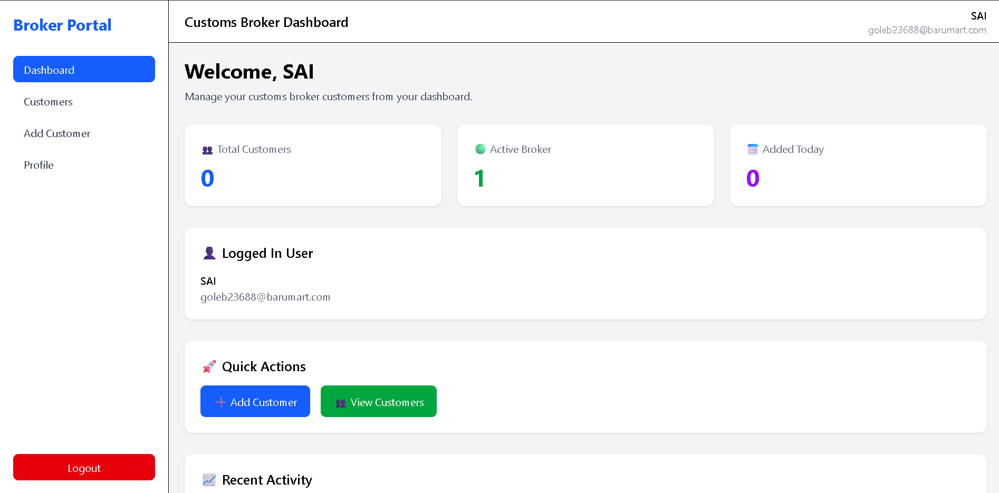

# 🚢 Customs Broker Onboarding System

A production-ready **Customs Broker Onboarding MVP** built with modern web technologies. The application enables customs brokers to securely onboard and manage importer/exporter customers through a responsive dashboard with authentication, customer management, and PostgreSQL-backed data storage.

> **Live Demo**
>
> **Frontend:** https://customs-broker-onboarding-mvp.vercel.app
> **Backend API:** https://customs-broker-api.onrender.com

---

# ✨ Features

* 🔐 Secure JWT Authentication
* 👤 Broker Registration & Login
* 👥 Customer Management (CRUD)
* 📊 Dashboard Overview
* 🛡️ Role-based Broker Data Isolation
* ✅ Client & Server-side Validation with Zod
* 🔒 Password Hashing using bcrypt
* ⚡ Rate Limiting & Security Headers
* 🌐 Responsive React UI
* 🚀 Production Deployment Ready

---

# 🛠 Tech Stack

## Frontend

* React 19
* Vite
* Tailwind CSS
* React Router
* React Hook Form
* Zod
* Axios

## Backend

* Node.js
* Express 5
* PostgreSQL
* JWT Authentication
* bcrypt
* Zod Validation

## Database

* Neon PostgreSQL

## Deployment

| Layer    | Platform        |
| -------- | --------------- |
| Frontend | Vercel          |
| Backend  | Render          |
| Database | Neon PostgreSQL |

---

# 🏗 Project Structure

```text
customs-broker-onboarding-MVP/
│
├── frontend/
│   ├── src/
│   ├── public/
│   ├── package.json
│   └── vite.config.js
│
├── backend/
│   ├── database/
│   │   ├── schema.sql
│   │   ├── seed.sql
│   │   └── migrations/
│   ├── src/
│   ├── package.json
│   └── .env.example
│
├── docker-compose.yml
├── README.md
└── LICENSE
```

---

# 🔌 API Endpoints

## Authentication

| Method | Endpoint           |
| ------ | ------------------ |
| POST   | /api/auth/register |
| POST   | /api/auth/login    |
| GET    | /api/auth/me       |

---

## Dashboard

| Method | Endpoint       |
| ------ | -------------- |
| GET    | /api/dashboard |

---

## Customers

| Method | Endpoint           |
| ------ | ------------------ |
| GET    | /api/customers     |
| POST   | /api/customers     |
| GET    | /api/customers/:id |
| PUT    | /api/customers/:id |
| DELETE | /api/customers/:id |

---

## Health

| Method | Endpoint    |
| ------ | ----------- |
| GET    | /api/health |

---

# 🔒 Security Features

* JWT Authentication (7-day expiry)
* bcrypt Password Hashing
* Helmet Security Headers
* API Rate Limiting
* Zod Request Validation
* Broker Data Isolation
* Environment Variable Validation
* Graceful Shutdown
* Production Error Handling
* Secure CORS Configuration

---

# 🐳 Docker Support

```bash
cp .env.example .env

docker compose up --build -d
```

Useful commands

```bash
docker compose ps

docker compose logs

docker compose down
```

---

# 🧪 Health Check

Backend

```
GET /api/health
```

The endpoint verifies:

* API availability
* Database connectivity
* Application health

---

# 📸 Screenshots

## Login Screen


## Register Screen


## Dashboard Screen



## Customer List Screen


## Add Customer Form Screen


## Mobile View

git

---

# 📈 Future Enhancements

* Email Verification
* Password Reset
* Audit Logs
* Role-Based Access Control
* Document Uploads
* Search & Filters
* CSV / Excel Export
* Notifications
* Analytics Dashboard
* Automated Testing

---

# 👨‍💻 Author

**Sai Unknown**

GitHub: https://github.com/sai-unknown

---

# 📄 License

This project is licensed under the MIT License.
